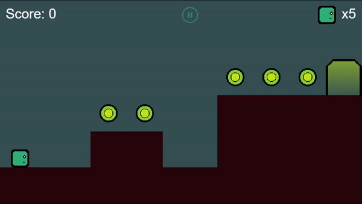

# Flame Simple Platformer

A 2D platformer made using the awesome [Flame engine](https://flame-engine.org/)




## Build/Run Steps

```bash
# Clone this project
$ git clone https://github.com/ufrshubham/flame_simple_platformer

# Access
$ cd ...

# Install dependencies
$ flutter pub get

# Run the project (Make sure that a virtual or physical device is connected first)
$ flutter run -d chrome

# The will start the game on any connected device.
```


